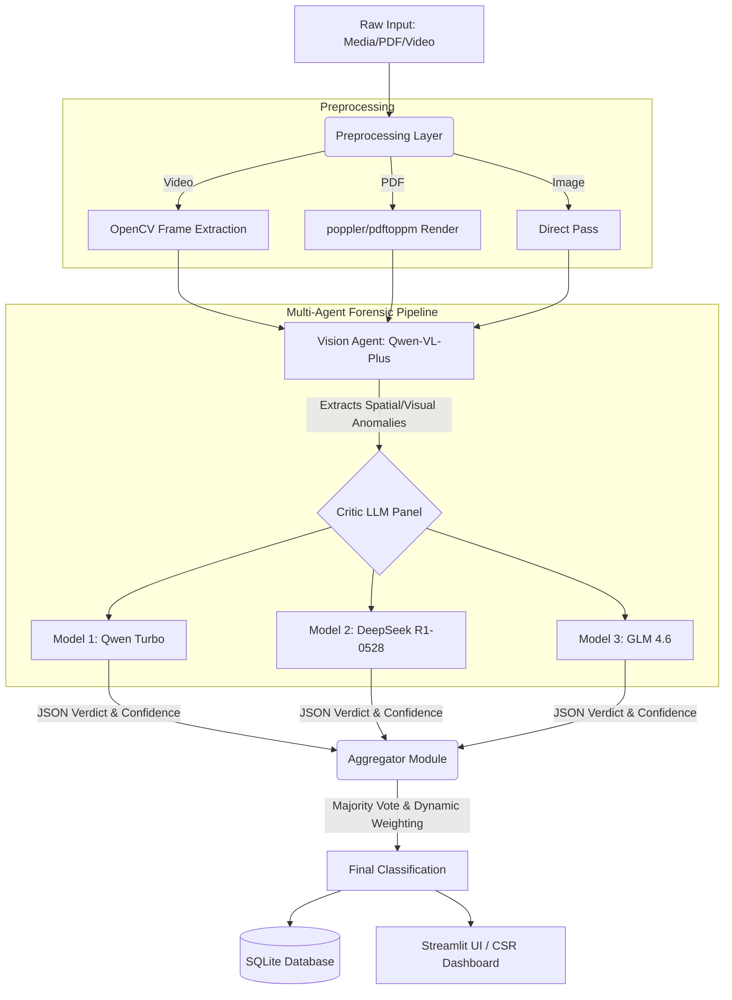

# Technical Report: FraudSight AI 
**Multi-Agent Forensic Pipeline for Insurance Fraud Detection**

## 1. Executive Summary
FraudSight AI is a specialized, multi-agent artificial intelligence system designed to detect digital forgery, deepfakes, and manipulation in insurance claims. Built to handle multimodal inputs (Images, Videos, and PDF Documents), the system replaces traditional single-model classifiers with a robust, deliberative pipeline. By separating the visual forensic extraction from the logical deduction process, the architecture achieves a high degree of calibration and significantly reduces hallucinations.

## 2. System Architecture
The platform is built on a **Vision-Critic-Aggregator** pattern, orchestrated via a Python backend and served through a Streamlit interface. 

## 3. Core Components & Technical Nuances

### 3.1 The Vision Agent (Visual Forensic Extractor)
Instead of forcing a single Vision-Language Model (VLM) to make a definitive "Real or Fake" judgment, the primary VLM (`qwen/qwen-vl-plus`) is strictly prompted to act as an objective forensic investigator. 
*   **Prompt Engineering:** The VLM is instructed to ignore the holistic meaning of the image and focus purely on localized artifacts (e.g., mismatched lighting gradients, unnatural blur boundaries, irregular text kerning in PDFs, and anatomical impossibilities in vehicle damage).
*   **Media Handling:** Base64 encoding is utilized over HTTP channels. For documents, `pdf2image` relies on `poppler` bindings to render vector PDFs into 300 DPI high-resolution rasters, ensuring the VLM can inspect microscopic typographical artifacts.

### 3.2 The Critic Panel (Logical Deductive Engine)
The raw, unstructured forensic observations from the Vision Agent are passed as text context to a panel of three structurally disparate Large Language Models. 
*   **Why a Panel?** Single LLMs are prone to confirmation bias. By forcing three distinct models to independently evaluate the visual examiner's notes, the system guards against arbitrary false positives.
*   **Structured Outputs:** The Critics are strictly constrained to output a predefined JSON schema containing `thought_process`, `classification`, `confidence_score`, and `reason`.
*   **Confidence Calibration:** A unique technical nuance in the prompt design forces each Critic to explicitly state the evidence required to *change its mind*. This adversarial self-reflection grounds the model's confidence scores, preventing overconfident hallucinations.

| Model | Architecture Role | Specialization |
| :--- | :--- | :--- |
| **Qwen-VL-Plus** | Vision Agent | High-resolution spatial reasoning and OCR anomaly detection. |
| **Qwen Turbo** | Primary Critic | Fast, generalized logical deduction of visual findings. |
| **DeepSeek R1-0528** | Analytical Critic | Deep reasoning paths with strong adherence to json formatting constraints. |
| **GLM 4.6** | Tie-Breaker Critic | Independent architectural weights to provide a contrarian perspective. |

### 3.3 Aggregator and State Management
The final phase handles the consolidation of the JSON outputs from the parallelized Critic panel.
*   **Threaded Execution:** To minimize latency, the three Critic models are queried simultaneously using `concurrent.futures.ThreadPoolExecutor`.
*   **Majority Voting:** A strict `N > Total/2` threshold determines the categorical label.
*   **Weighted Confidence Formulation:** The final system confidence is not a simple average. It is calculated by isolating the confidence scores of the *winning majority*, discarding dissenting scores, and averaging the remaining values to produce a calibrated metric representing the strength of the consensus.

## 4. Video Processing Heuristics
Video fraud detection represents a significant technical hurdle due to token limits and API cost. The system utilizes `OpenCV` (`cv2`) to perform temporal downsampling.
1.  **Uniform Frame Extraction:** Videos are parsed and downsampled to exactly 5 equidistant frames.
2.  **Stateless Frame Analysis:** Each frame is passed sequentially through the entire Vision-Critic pipeline as an isolated image.
3.  **Temporal Aggregation:** A "Fake" classification on *any single frame* immediately flags the entire video as "Suspicious/Fake". This conservative heuristic is vital, as a deepfake video may only reveal its temporal inconsistencies or edge-artifact failures (e.g., glitching reflections) in a specific subset of frames.

## 5. Deployment & Runtime Constraints
*   **Database:** A localized `SQLite3` instance tracks historical predictions, processing times, and ground-truth comparisons to facilitate real-time dashboard analytics without network database latency.
*   **Environment:** Deployed via Render, the application utilizes a `uvicorn`-backed ASGI environment to run the Streamlit WebSockets, dynamically installing native Linux dependencies (like `libgl1` for OpenCV) during the container build phase.
